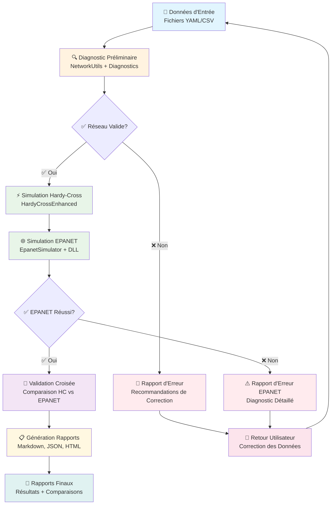

# 🔄 WORKFLOW COMPLET AEP - LCPI v2.1.0

## 📊 Diagramme de Workflow



## 📋 Description Détaillée des Étapes

### **Étape 1 : Chargement des Données d'Entrée**
**Description :** L'utilisateur fournit un fichier de configuration du réseau au format YAML ou CSV contenant les nœuds, conduites et leurs propriétés hydrauliques.

**Fonctions Clés :**
- `load_hardy_cross_yaml()` - Chargement depuis YAML
- `load_hardy_cross_csv()` - Chargement depuis CSV
- `NetworkUtils.validate_network_structure()` - Validation de la structure

**Entrée :**
- `network.yml` ou `network.csv`
- Format LCPI standard ou conventions alternatives

**Sortie :**
- Dictionnaire Python `network_data`
- Structure validée avec nœuds et conduites

**Exemple de Données :**
```yaml
network:
  nodes:
    R1:
      type: reservoir
      elevation: 120
      demand: 0.0
    N1:
      type: junction
      elevation: 100
      demand: 0.05
  pipes:
    P1:
      from_node: R1
      to_node: N1
      length: 1000
      diameter: 0.2
      roughness: 120
```

---

### **Étape 2 : Diagnostic Préliminaire**
**Description :** Avant tout calcul, le système valide la cohérence topologique et hydraulique du réseau en utilisant les outils de diagnostic avancés.

**Fonctions Clés :**
- `diagnose_network_connectivity()` - Vérification de la connectivité
- `validate_epanet_compatibility()` - Validation EPANET
- `analyze_network_topology()` - Analyse topologique
- `NetworkUtils.get_pipe_nodes()` - Lecture flexible des données

**Entrée :**
- Dictionnaire `network_data`

**Sortie :**
- Rapport de diagnostic détaillé (console)
- Booléen de validité du réseau
- Statistiques topologiques
- Liste des problèmes détectés

**Vérifications Effectuées :**
- ✅ Présence de sources d'eau (réservoirs/tanks)
- ✅ Connectivité du réseau (composantes connexes)
- ✅ Validité des dimensions des conduites
- ✅ Cohérence des demandes
- ✅ Compatibilité EPANET

**Branchement :**
- **Si invalide** → Arrêt avec recommandations de correction
- **Si valide** → Passage à la simulation

---

### **Étape 3 : Simulation Hardy-Cross**
**Description :** Exécution du calcul hydraulique avec l'algorithme Hardy-Cross amélioré, incluant la détection automatique de cycles et la convergence optimisée.

**Fonctions Clés :**
- `HardyCrossEnhanced.solve()` - Résolution principale
- `HardyCrossEnhanced.detect_cycles()` - Détection de cycles
- `HardyCrossEnhanced.validate_convergence()` - Validation convergence

**Entrée :**
- Dictionnaire `network_data` validé

**Sortie :**
- Résultats Hardy-Cross (`hardy_cross_results`)
- Statistiques de convergence
- Temps de calcul
- Débits et pressions par nœud/conduite

**Métriques de Convergence :**
- Nombre d'itérations
- Tolérance finale
- Temps de calcul
- Statut de convergence

---

### **Étape 4 : Simulation EPANET**
**Description :** Exécution de la simulation via l'interface EPANET en utilisant la DLL native, avec génération automatique du fichier .inp et gestion d'erreurs robuste.

**Fonctions Clés :**
- `create_epanet_inp_file()` - Génération fichier .inp
- `EpanetSimulator.open_project()` - Ouverture projet
- `EpanetSimulator.solve_hydraulics()` - Résolution hydraulique
- `EpanetSimulator.extract_results()` - Extraction résultats

**Entrée :**
- Dictionnaire `network_data` validé
- DLL EPANET 2.2

**Sortie :**
- Résultats EPANET (`epanet_results`)
- Fichier .inp temporaire
- Statistiques de simulation
- Débits et pressions par nœud/conduite

**Gestion d'Erreurs :**
- Erreur 110 (équations insolubles) → Diagnostic automatique
- Erreur 6 (pressions négatives) → Avertissement
- Autres erreurs → Messages détaillés

---

### **Étape 5 : Validation Croisée**
**Description :** Comparaison systématique des résultats entre Hardy-Cross et EPANET pour valider la cohérence des calculs et identifier les éventuelles divergences.

**Fonctions Clés :**
- `compare_results()` - Comparaison des résultats
- `calculate_differences()` - Calcul des écarts
- `validate_consistency()` - Validation de cohérence

**Entrée :**
- `hardy_cross_results`
- `epanet_results`

**Sortie :**
- Rapport de comparaison (`comparison_report`)
- Métriques de cohérence
- Liste des divergences
- Recommandations

**Métriques de Comparaison :**
- Écarts relatifs sur les débits
- Écarts relatifs sur les pressions
- Corrélation entre les méthodes
- Points de divergence identifiés

---

### **Étape 6 : Génération de Rapports**
**Description :** Production de rapports complets incluant les résultats détaillés, les comparaisons, les diagnostics et les recommandations dans différents formats.

**Fonctions Clés :**
- `generate_markdown_report()` - Rapport Markdown
- `generate_json_report()` - Rapport JSON
- `generate_html_report()` - Rapport HTML
- `generate_comparison_report()` - Rapport de comparaison

**Entrée :**
- `hardy_cross_results`
- `epanet_results`
- `comparison_report`
- `diagnostic_report`

**Sortie :**
- Fichiers de rapport multiples
- Données structurées
- Visualisations (si applicable)

**Formats de Sortie :**
- **Markdown** : Documentation technique
- **JSON** : Données structurées
- **HTML** : Rapport interactif
- **CSV** : Données tabulaires

---

### **Étape 7 : Rapports Finaux**
**Description :** Consolidation et présentation des résultats finaux avec synthèse, recommandations et métriques de qualité.

**Contenu des Rapports :**
- **Résumé Exécutif** : Vue d'ensemble des résultats
- **Résultats Détaillés** : Données complètes par nœud/conduite
- **Comparaison Méthodes** : Analyse des écarts
- **Diagnostics** : Problèmes détectés et résolus
- **Recommandations** : Actions suggérées
- **Métriques de Qualité** : Indicateurs de performance

**Artefacts Produits :**
- `rapport_final.md` - Rapport principal
- `resultats_hardy_cross.json` - Données Hardy-Cross
- `resultats_epanet.json` - Données EPANET
- `comparaison_methodes.json` - Comparaison
- `diagnostic_reseau.md` - Diagnostic détaillé

---

## 🔄 Gestion des Erreurs et Retours

### **Branchement en Cas d'Erreur**
Le workflow inclut des points de contrôle qui permettent de détecter et gérer les erreurs :

1. **Erreur de Chargement** → Retour à l'étape 1
2. **Erreur de Diagnostic** → Recommandations de correction
3. **Erreur Hardy-Cross** → Diagnostic de convergence
4. **Erreur EPANET** → Analyse des causes
5. **Divergence des Résultats** → Analyse approfondie

### **Recommandations Automatiques**
Le système génère automatiquement des recommandations basées sur les erreurs détectées :

- **Réseau non connecté** → Ajout de réservoirs/conduites
- **Pressions négatives** → Ajustement des élévations
- **Convergence lente** → Optimisation des paramètres
- **Divergences importantes** → Vérification des données

---

## 🎯 Utilisation Typique

### **Script de Démarrage Rapide**
```python
from lcpi.aep.core.epanet_integration import run_epanet_with_diagnostics
from lcpi.aep.core.network_diagnostics import diagnose_network_connectivity

# Chargement et diagnostic
network_data = load_network_yaml("mon_reseau.yml")
if diagnose_network_connectivity(network_data):
    # Simulation complète
    results = run_epanet_with_diagnostics(network_data)
    if results['success']:
        print("✅ Simulation réussie")
        generate_reports(results)
    else:
        print("❌ Erreurs:", results['errors'])
else:
    print("❌ Réseau invalide - corrigez avant simulation")
```

### **Workflow Complet avec Contrôles**
```python
# 1. Chargement
network_data = load_network_data("reseau.yml")

# 2. Diagnostic
if not diagnose_network_connectivity(network_data):
    print("❌ Réseau invalide")
    exit(1)

# 3. Validation EPANET
validation = validate_epanet_compatibility(network_data)
if not validation["compatible"]:
    print("❌ Incompatible EPANET:", validation["erreurs"])
    exit(1)

# 4. Simulations
hardy_results = run_hardy_cross(network_data)
epanet_results = run_epanet_simulation(network_data)

# 5. Comparaison
comparison = compare_results(hardy_results, epanet_results)

# 6. Rapports
generate_complete_reports(network_data, hardy_results, epanet_results, comparison)
```

---

## 📈 Métriques de Performance

### **Temps Typiques par Étape**
- **Chargement** : 0.1-1.0 secondes
- **Diagnostic** : 0.5-2.0 secondes
- **Hardy-Cross** : 1.0-30.0 secondes (selon taille)
- **EPANET** : 0.5-10.0 secondes
- **Comparaison** : 0.1-1.0 secondes
- **Rapports** : 0.5-2.0 secondes

### **Taille des Réseaux Supportés**
- **Petits réseaux** : < 100 nœuds
- **Réseaux moyens** : 100-1000 nœuds
- **Grands réseaux** : 1000-10000 nœuds
- **Très grands réseaux** : > 10000 nœuds (avec optimisations)

---

## 🎯 Conclusion

Ce workflow AEP complet offre un processus robuste et automatisé pour la simulation hydraulique, avec :

1. **Validation automatique** des données d'entrée
2. **Diagnostic préventif** des problèmes
3. **Simulation double** (Hardy-Cross + EPANET)
4. **Validation croisée** des résultats
5. **Rapports complets** et actionables
6. **Gestion d'erreurs** robuste

Le système garantit la qualité des résultats tout en fournissant des diagnostics clairs et des recommandations utiles pour l'utilisateur. 